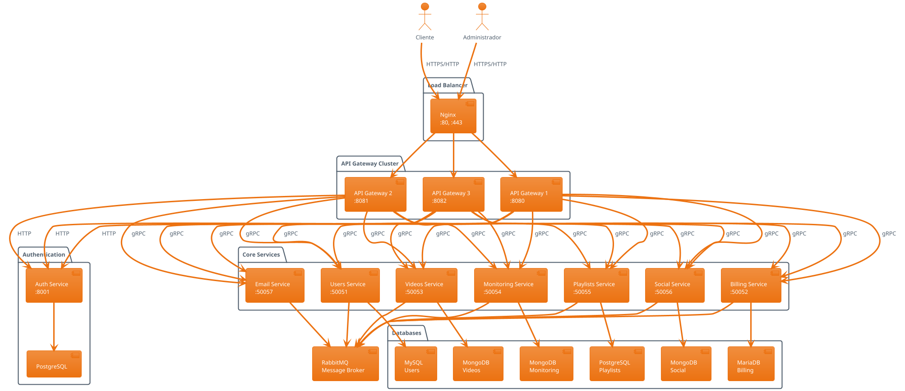
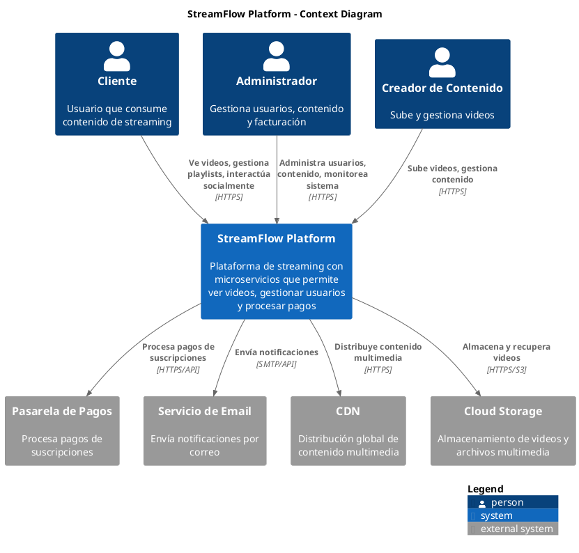
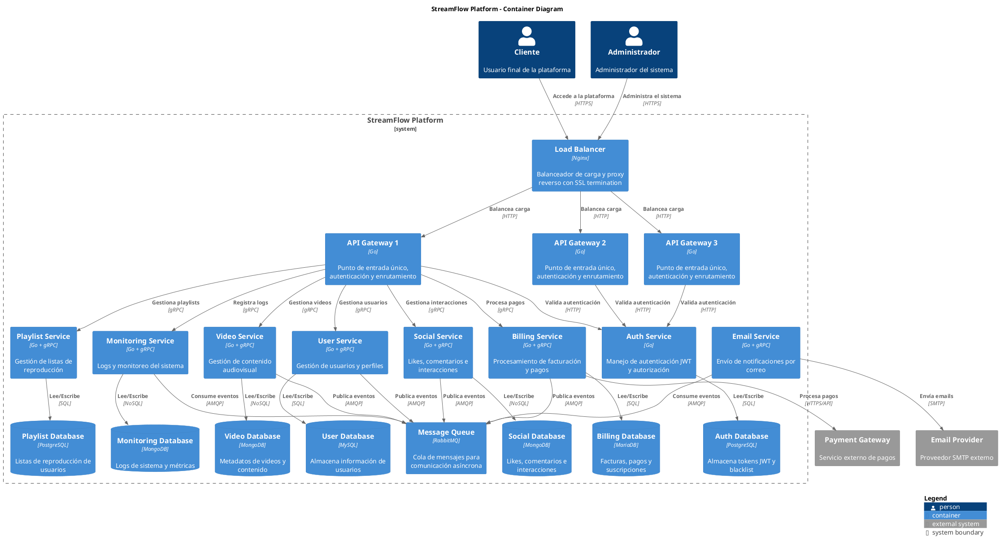
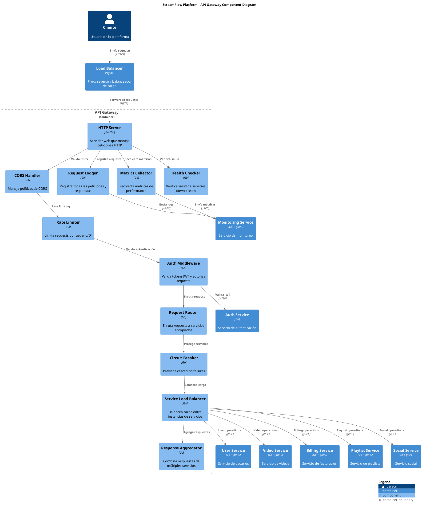
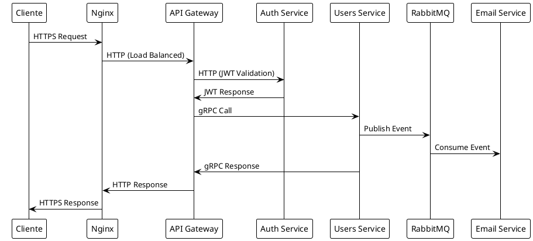

<!-- ====================================================================== -->
<!--                          STREAMFLOW PLATFORM                         -->
<!--                     Modern Microservices Architecture                -->
<!-- ====================================================================== -->

<h1 align="center">🎬 StreamFlow Platform</h1>

<p align="center">
  <b><i>Plataforma de Streaming con Arquitectura de Microservicios</i></b>
</p>

<p align="center">
  <a href="https://www.docker.com/">
    
  </a>
  <a href="https://golang.org/">
    
  </a>
  <a href="https://grpc.io/">
    
  </a>
  <a href="https://www.postgresql.org/">
    
  </a>
  <a href="https://www.mongodb.com/">
    
  </a>
  <a href="https://www.rabbitmq.com/">
    
  </a>
  <a href="https://nginx.org/">
    
  </a>
</p>

<p align="center">
  
  
  
</p>

<p align="justify">
<b>StreamFlow</b> es una plataforma de streaming moderna construida con <i>arquitectura de microservicios</i>, diseñada para <b><i>escalabilidad</i></b>, <b><i>alta disponibilidad</i></b> y <b><i>rendimiento óptimo</i></b>. La plataforma permite a los usuarios ver contenido audiovisual, gestionar playlists, interactuar socialmente y procesar pagos de manera segura y eficiente.
</p>


<!-- ====================================================================== -->
<!--                           TABLE OF CONTENTS                           -->
<!-- ====================================================================== -->

<details>
<summary><b>📚 Tabla de Contenidos</b></summary>

<ol>
  <li><a href="#-arquitectura-del-sistema">🏗️ Arquitectura del Sistema</a>
    <ul>
      <li><a href="#️-diagrama-de-arquitectura">🏗️ Diagrama de Arquitectura</a></li>
    </ul>
  </li>
  <li><a href="#-modelo-c4---arquitectura-por-capas">📐 Modelo C4 - Arquitectura por Capas</a>
    <ul>
      <li><a href="#-nivel-1-contexto-del-sistema">🌍 Nivel 1: Contexto del Sistema</a></li>
      <li><a href="#-nivel-2-contenedores">📦 Nivel 2: Contenedores</a></li>
      <li><a href="#️-nivel-3-componentes-api-gateway">⚙️ Nivel 3: Componentes (API Gateway)</a></li>
    </ul>
  </li>
  <li><a href="#-microservicios">🔧 Microservicios</a></li>
  <li><a href="#-patrones-de-comunicación">🔄 Patrones de Comunicación</a></li>
  <li><a href="#-despliegue">🚀 Despliegue</a>
    <ul>
      <li><a href="#-prerequisitos">📋 Prerequisitos</a></li>
      <li><a href="#-inicio-rápido">🏁 Inicio Rápido</a></li>
      <li><a href="#-estado-del-sistema">📈 Estado del Sistema</a></li>
    </ul>
  </li>
  <li><a href="#-credenciales-por-defecto">🔐 Credenciales por Defecto</a></li>
  <li><a href="#-api-endpoints">🔌 API Endpoints</a>
    <ul>
      <li><a href="#-autenticación">🔐 Autenticación</a></li>
      <li><a href="#-usuarios">👥 Usuarios</a></li>
      <li><a href="#-facturación">💳 Facturación</a></li>
      <li><a href="#-videos">🎬 Videos</a></li>
      <li><a href="#-monitoreo">📊 Monitoreo</a></li>
      <li><a href="#-listas-de-reproducción">📋 Listas de Reproducción</a></li>
      <li><a href="#-interacciones-sociales">💬 Interacciones Sociales</a></li>
    </ul>
  </li>
  <li><a href="#-monitoreo-y-observabilidad">📊 Monitoreo y Observabilidad</a></li>
  <li><a href="#-desarrollo">💻 Desarrollo</a>
    <ul>
      <li><a href="#-estructura-del-proyecto">📁 Estructura del Proyecto</a></li>
      <li><a href="#-testing">🧪 Testing</a></li>
    </ul>
  </li>
  <li><a href="#-seguridad">🔒 Seguridad</a></li>
  <li><a href="#-troubleshooting">🔧 Troubleshooting</a></li>
  <li><a href="#-contribución">🤝 Contribución</a></li>
  <li><a href="#-licencia">📄 Licencia</a></li>
</ol>

</details>


## 🏗️ Arquitectura del Sistema

### 🏗️ Diagrama de Arquitectura

<div align="center">
  
</div>

<details>
<summary><b>📐 Modelo C4 - Arquitectura por Capas</b></summary>

<p align="justify">
Los siguientes diagramas siguen el <a href="https://c4model.com/"><b>modelo C4</b></a> para documentar la arquitectura del sistema en diferentes niveles de abstracción.
</p>

### 🌍 Nivel 1: Contexto del Sistema

<div align="center">
  
  <p><em>Vista general del sistema y sus usuarios externos</em></p>
</div>

### 📦 Nivel 2: Contenedores

<div align="center">
  
  <p><em>Arquitectura de alto nivel mostrando contenedores principales</em></p>
</div>

### ⚙️ Nivel 3: Componentes (API Gateway)

<div align="center">
  
  <p><em>Detalle interno de los componentes del API Gateway</em></p>
</div>

</details>


### 🔧 Microservicios

| 🚀 Servicio | 🔌 Puerto | 📡 Protocolo | 🗄️ Base de Datos | 📋 Responsabilidades |
|-------------|-----------|-------------|------------------|---------------------|
| **🔐 Autenticación** | 8001 | HTTP | PostgreSQL | JWT, blacklist, login/logout |
| **👥 Usuarios** | 50051 | gRPC | MySQL | CRUD usuarios, gestión de roles |
| **💳 Facturación** | 50052 | gRPC | MariaDB | Gestión facturas y pagos |
| **🎬 Videos** | 50053 | gRPC | MongoDB | Gestión contenido audiovisual |
| **📊 Monitoreo** | 50054 | gRPC | MongoDB | Logs de acciones y errores |
| **📋 Listas de Reproducción** | 50055 | gRPC | PostgreSQL | Playlists de usuarios |
| **💬 Interacciones Sociales** | 50056 | gRPC | MongoDB | Likes y comentarios |
| **📧 Envío de Correos** | 50057 | gRPC | - | Notificaciones por email |
| **🚪 API Gateway** | 8080-8082 | HTTP | - | Punto de entrada único |

### 🔄 Patrones de Comunicación

<div align="center">
  
</div>

### 📊 Tabla de Comunicación

| 🔗 Tipo | 📡 Protocolo | 📝 Descripción |
|---------|-------------|----------------|
| **Externa → Nginx** | HTTPS/HTTP | Conexiones de clientes |
| **Nginx → API Gateway** | HTTP | Balance de carga |
| **API Gateway → Auth** | HTTP | Validación de tokens |
| **API Gateway → Servicios** | gRPC | Comunicación eficiente |
| **Entre Microservicios** | RabbitMQ | Mensajería asíncrona |

### ⚖️ Balanceador de Carga

- **🌐 Nginx**: Puertos 80 (HTTP) y 443 (HTTPS)
- **🔄 Balanceo**: Round-robin entre 3 instancias del API Gateway
- **🔒 SSL/TLS**: Certificados configurados automáticamente

## 🚀 Despliegue

### 📋 Prerequisitos

- 🐳 **Docker** v20.10+ y **Docker Compose** v2.0+
- 💾 **RAM**: Al menos 8GB disponible
- 💿 **Espacio en disco**: 5GB libres
- 🌐 **Puertos**: 80, 443, 8080-8082, 15672 disponibles

### 🏁 Inicio Rápido

```bash
# 📥 Clonar el repositorio
git clone https://github.com/nico-alvz/taller23-arqui.git
cd taller23-arqui

# 🚀 Iniciar todos los servicios
docker-compose up -d

# 📊 Verificar estado de servicios
docker-compose ps

# 📋 Ver logs en tiempo real
docker-compose logs -f
```

### 📈 Estado del Sistema

```bash
# ✅ Verificar salud de todos los servicios
docker-compose ps --format "table {{.Name}}\t{{.Status}}\t{{.Ports}}"

# 🔍 Verificar conectividad
curl -k https://localhost/health
```

### Configuración de Base de Datos

Las bases de datos se inicializan automáticamente al iniciar los contenedores.

### Seeder

Para poblar las bases de datos con datos de prueba:

```bash
# Ejecutar seeder
docker-compose exec api-gateway-1 /app/scripts/seed.sh
```

## 🔐 Credenciales por Defecto

### 👤 Usuario Administrador
```
📧 Email: admin@streamflow.com
🔑 Contraseña: admin123
```

### 🗄️ Bases de Datos
| 🗃️ Base de Datos | 👤 Usuario | 🔑 Contraseña | 🔌 Puerto |
|------------------|------------|---------------|----------|
| **PostgreSQL** | postgres | password | 5432 |
| **MySQL** | root | password | 3306 |
| **MariaDB** | root | password | 3307 |
| **MongoDB** | root | password | 27017 |
| **RabbitMQ** | admin | password | 5672, 15672 |

## 🔌 API Endpoints

### 🎯 Base URL
```
HTTPS: https://localhost
HTTP:  http://localhost
```

### 🔐 Autenticación
| Método | Endpoint | Descripción |
|--------|----------|-------------|
| `POST` | `/auth/login` | 🚪 Iniciar sesión |
| `PATCH` | `/auth/usuarios/{id}` | 🔑 Cambiar contraseña |
| `POST` | `/auth/logout` | 🚪 Cerrar sesión |

### 👥 Usuarios
| Método | Endpoint | Descripción |
|--------|----------|-------------|
| `POST` | `/usuarios` | ➕ Crear usuario |
| `GET` | `/usuarios/{id}` | 👁️ Obtener usuario |
| `PATCH` | `/usuarios/{id}` | ✏️ Actualizar usuario |
| `DELETE` | `/usuarios/{id}` | 🗑️ Eliminar usuario |
| `GET` | `/usuarios` | 📋 Listar usuarios |

### 💳 Facturación
| Método | Endpoint | Descripción |
|--------|----------|-------------|
| `POST` | `/facturas` | 📄 Crear factura |
| `GET` | `/facturas/{id}` | 👁️ Obtener factura |
| `PATCH` | `/facturas/{id}` | ✏️ Actualizar factura |
| `DELETE` | `/facturas/{id}` | 🗑️ Eliminar factura |
| `GET` | `/facturas` | 📋 Listar facturas |

### 🎬 Videos
| Método | Endpoint | Descripción |
|--------|----------|-------------|
| `POST` | `/videos` | 📤 Subir video |
| `GET` | `/videos/{id}` | 👁️ Obtener video |
| `PATCH` | `/videos/{id}` | ✏️ Actualizar video |
| `DELETE` | `/videos/{id}` | 🗑️ Eliminar video |
| `GET` | `/videos` | 📋 Listar videos |

### 📊 Monitoreo
| Método | Endpoint | Descripción |
|--------|----------|-------------|
| `GET` | `/monitoreo/acciones` | 📈 Listar acciones |
| `GET` | `/monitoreo/errores` | ❌ Listar errores |

### 📋 Listas de Reproducción
| Método | Endpoint | Descripción |
|--------|----------|-------------|
| `POST` | `/listas-reproduccion` | ➕ Crear lista |
| `POST` | `/listas-reproduccion/{id}/videos` | 📼 Añadir video |
| `GET` | `/listas-reproduccion` | 👁️ Ver listas |
| `GET` | `/listas-reproduccion/{id}/videos` | 🎵 Ver videos de lista |
| `DELETE` | `/listas-reproduccion/{id}/videos` | ➖ Eliminar video de lista |
| `DELETE` | `/listas-reproduccion/{id}` | 🗑️ Eliminar lista |

### 💬 Interacciones Sociales
| Método | Endpoint | Descripción |
|--------|----------|-------------|
| `POST` | `/interacciones/{id}/likes` | 👍 Dar like |
| `POST` | `/interacciones/{id}/comentarios` | 💬 Comentar |
| `GET` | `/interacciones/{id}` | 👁️ Ver interacciones |

## 📊 Monitoreo y Observabilidad

### 🐰 RabbitMQ Management Console
```
🌐 URL: http://localhost:15672
👤 Usuario: admin
🔑 Contraseña: password
```

### 📋 Logs del Sistema
```bash
# 🔍 Ver logs de un servicio específico
docker-compose logs -f [service-name]

# 🌐 Ver logs de Nginx
docker-compose logs -f nginx

# 📊 Ver logs de todos los servicios
docker-compose logs --tail=100 -f

# 🔍 Filtrar logs por nivel
docker-compose logs -f | grep ERROR
```

### 📈 Métricas de Sistema
```bash
# 💾 Uso de recursos por contenedor
docker stats

# 🔍 Estado detallado de servicios
docker-compose ps --services --filter "status=running"
```

## 💻 Desarrollo

### 📁 Estructura del Proyecto

```
🏗️ streamflow/
├── 🔧 services/              # Microservicios
│   ├── 🔐 auth/             # Servicio de autenticación
│   ├── 👥 users/            # Servicio de usuarios  
│   ├── 💳 billing/          # Servicio de facturación
│   ├── 🎬 videos/           # Servicio de videos
│   ├── 📊 monitoring/       # Servicio de monitoreo
│   ├── 📋 playlists/        # Servicio de listas
│   ├── 💬 social/           # Servicio social
│   └── 📧 email/            # Servicio de email
├── 🚪 api-gateway/          # API Gateway
├── 🌐 nginx/                # Configuración Nginx
├── 📡 protos/               # Archivos Protocol Buffers
├── 🔧 scripts/              # Scripts de utilidad
├── 📮 postman/              # Colecciones Postman
├── 🧪 e2e/                  # Tests End-to-End
├── 📚 docs/                 # Documentación
└── 🐳 docker-compose.yml    # Orquestación de servicios
```

### 🧪 Testing

#### 📮 Colecciones Postman

| 🎯 Flujo | 📝 Descripción | 🎬 Casos de Uso |
|----------|----------------|------------------|
| **👤 Cliente** | Experiencia del usuario final | Registro, login, ver videos, dar likes |
| **👑 Administrador** | Gestión administrativa | Facturas, usuarios, contenido |
| **📋 Listas** | Gestión de playlists | Crear, editar, compartir listas |
| **🔄 Completo** | Flujo end-to-end | Casos de uso integrados |

#### 🤖 Tests Automatizados
```bash
# 🧪 Ejecutar tests E2E
cd e2e
npm test

# 🔍 Tests específicos por servicio
npm run test:auth
npm run test:users
npm run test:videos
```

## 🔒 Seguridad

### 🎫 Autenticación JWT
- ⏰ **Expiración**: Tokens válidos por 24 horas
- 🚫 **Blacklist**: Logout seguro con invalidación de tokens
- 🛡️ **Validación**: Verificación centralizada en API Gateway
- 🔄 **Refresh**: Renovación automática de tokens

### 🔐 HTTPS/SSL
- 📜 **Certificados**: Autofirmados incluidos para desarrollo
- ↩️ **Redirección**: HTTP → HTTPS automática
- 🛡️ **Headers**: Configuración de seguridad avanzada
- 🔒 **TLS**: Versión 1.2+ requerida

### ✅ Validaciones y Autorización
- 👑 **Roles**: Autorización basada en roles de usuario
- 🔍 **Validación**: Entrada sanitizada en todos los endpoints
- 🗑️ **Soft Delete**: Eliminación segura de datos sensibles
- 🛡️ **CORS**: Configuración restrictiva de origen cruzado

## 🔧 Troubleshooting

### ⚠️ Problemas Comunes

#### 🚫 Servicios no inician
```bash
# 🔄 Reinicio completo del sistema
docker-compose down --volumes
docker-compose up -d

# 🧹 Limpiar recursos de Docker
docker system prune -f
```

#### 🗄️ Error de conexión de base de datos
```bash
# ✅ Verificar estado de contenedores
docker-compose ps

# 🔄 Reiniciar base de datos específica
docker-compose restart postgres
docker-compose restart mysql
docker-compose restart mongodb

# 📊 Verificar logs de BD
docker-compose logs postgres
```

#### 🐰 RabbitMQ no conecta
```bash
# 🔄 Reiniciar RabbitMQ
docker-compose restart rabbitmq

# 🔍 Verificar estado
docker-compose exec rabbitmq rabbitmqctl status
```

#### 📋 Logs de depuración
```bash
# 📊 Ver todos los logs
docker-compose logs --tail=50

# 🔍 Logs de un servicio específico
docker-compose logs -f [service-name]

# ❌ Filtrar solo errores
docker-compose logs | grep -i error
```

### 🆘 Comandos de Diagnóstico
```bash
# 💾 Verificar recursos del sistema
docker system df

# 🔍 Estado detallado de contenedores
docker inspect $(docker-compose ps -q)

# 🌐 Verificar conectividad de red
docker network ls
docker network inspect streamflow_default
```

## 🤝 Contribución

### 🔄 Flujo de Desarrollo

1. 🍴 **Fork** el repositorio
2. 🌿 **Branch**: `git checkout -b feature/nueva-funcionalidad`
3. ✏️ **Commit**: `git commit -am 'feat: agregar nueva funcionalidad'`
4. 📤 **Push**: `git push origin feature/nueva-funcionalidad`
5. 🔄 **Pull Request**: Crear PR con descripción detallada

### 📝 Convenciones

- **Commits**: Usar [Conventional Commits](https://www.conventionalcommits.org/)
- **Código**: Seguir estándares Go y best practices
- **Tests**: Incluir tests para nuevas funcionalidades
- **Documentación**: Actualizar README y docs relevantes

---

<div align="center">

## 📄 Licencia

**Este proyecto es para fines educativos del curso de Arquitectura de Sistemas.**

### 👨‍💻 Desarrollado por

**Nicolás Álvarez** - *Taller de Arquitectura de Sistemas*

---

### ⭐ ¿Te gusta el proyecto?

¡Dale una estrella! ⭐ Ayuda a otros desarrolladores a encontrar este proyecto.

[](https://github.com/nico-alvz/taller23-arqui)

</div>
